# Changing the channel and/or frequency of the bridged network#
---
## Background ##

The TP-Link AC1750 and AC1200 are bridged to form a WDS (Wireless Distribution System). In this configuration, the AC1750 installed on the boat handles the routing and runs the DHCP server while the AC1200 provides an alternative wired/wireless access point for connecting to the boat from the shore.

A bridged network is necessary as the RoboBoat competition rules require that all teams provide an RJ45 ethernet port on their shore-side control station to allow the competition staff to connect to an interface with the boat's computers.

When configuring a WDS, a wireless frequency band (2.4GHz or 5GHz) and a channel must be selected. Ideally, a frequency and channel with no or minimal usage should be selected to improve the connection quality by reducing interference. Different locations will likely have different wireless networks operating on different frequencies/channels. Therefore, it may be necessary to change the frequency and channel used to form the WDS to ensure the integrity of the communication link.

The WDS can be configured on either the 2.4GHz or 5GHz bands, but we recommend that the 2.4GHz band be used whenever possible as it provides a better transmission range.

---
## Step 1) Finding the optimal frequency/channel pair ##

 1. To find the optimal frequency and channel pair all routers with the exception of the GL.iNet GL-AR750 should be turned off.

 1. Next, a network utility such should be used to find the best frequency channel combination to create the WDS.
  - macOS: Using the **Wireless Diagnostics** stock macOS application.
     1. Open the **Wireless Diagnostics** app that is preinstalled
     1. From the menu options, select **Window**->**Scan**
     1. Click the **Scan Now** button in the bottom left corner of the window
     1. The summary table will contain the best channels for both the 2.4GHz and 5GHz frequencies, both of which are boxed in red below: 
  - Windows: Using the **WiFi Analyzer** application from the Microsoft Store
     1. Download the **WiFi Analyzer** application ([Download Link](https://www.microsoft.com/en-us/p/wifi-analyzer/9nblggh33n0n)).
     1. Open the application and click the **Analyze** icon at the top of the window
     1. The channel recommendation for the 2.4GHz band is shown at the bottom of the window and boxed in red in the example image below:
    
     1. The optimal 5GHz channel can be found by clicking on the **5 GHz** icon in the bottom right corner of the window shown above.

---
## Step 2) Configuring the AC1750 ##

Now that the optimal channel and band have been identified, the routers must be configured. First, we will configure the AC1750, which is installed on the boat.
 1. As the routers were turned off when finding the optimal channel/band, turn both routers (the AC1750 and AC1200) back on.

 1. Connect to the AC1750's network wirelessly (SSID: **TempleBoat_Onboard**) or with an ethernet cable

 1. Open a web browser and navigate to the AC1750's admin console (located at [10.19.122.1](10.19.122.1)).

 1. Login using the credentials and click on the the **Advanced** tab at the top of the web page, which is boxed in red in the screenshot below:
 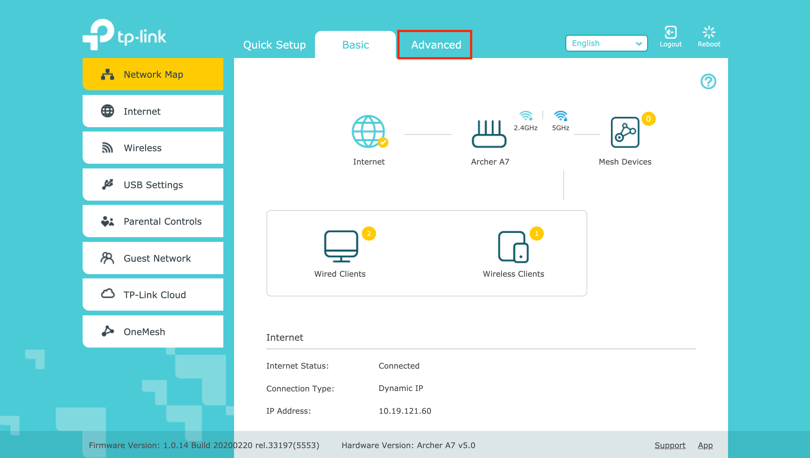

 1. Next, expand the **Wireless** menu (labeled as 1 in the image below) on the left side of the page and then select the **Wireless Settings** menu item (labeled as 2 in the image below).
 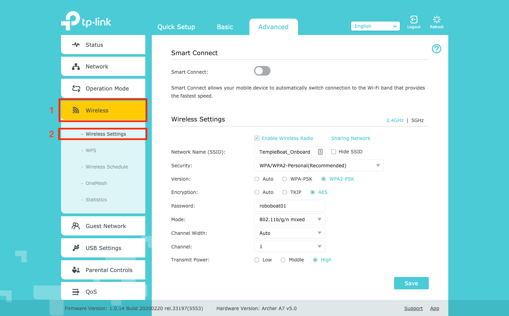

 1. Finally, we need to configure the channel. Select the **Channel** drop-down list boxed in red in the image below and enter select the channel that the WDS will use on. If you are using the 5GHz band to form the WDS, click the **5GHz** text on the middle right of the page and enter the channel there.
 
  *Note: If you are creating a bridge on the 2.4GHz band, make sure that the Channel for the 5GHz band is set to "Auto", similarly, if you are bridging on the 5GHz band, make sure the Channel for the 2.4GHz band is set to "Auto".*

 1. After editing the **Channel** settings, make sure to click the **Save** button at the bottom of the page to complete the AC1750 configuration.

---
## Step 3) Configuring the AC1200 ##

The AC1200 is configured as an access point in the WDS for the AC1750's network, so the AC1200's DHCP server is disabled. Therefore, you cannot access the AC1200's admin console by connecting to the AC1200 opening its IP address in a web browser like we did for the AC1750. Instead, the computer being used to connect to the AC1200 must self-assign an IP address and select the the AC1200 as its router temporarily. If this is done correctly, we can then access the AC1200's management console to configure the WDS.

1. Connect to the AC1200's network wirelessly (SSID: **TempleBoat_Shore**) or with an ethernet cable.

1. Manually configure IPv4
  - macOS
    1. Open the **Network** settings in **System Preferences**
    

    1. Click the **Advanced...** button in the bottom right corner of the window
    

    1. In the **TCP/IP** tab, change the **Configure IPv4** drop-down menu from **Automatic** to **Manual** and then fill in the **IPv4 Address**, **Subnet Mask**, and **Router** text boxes with the information show below before clicking **OK**.
    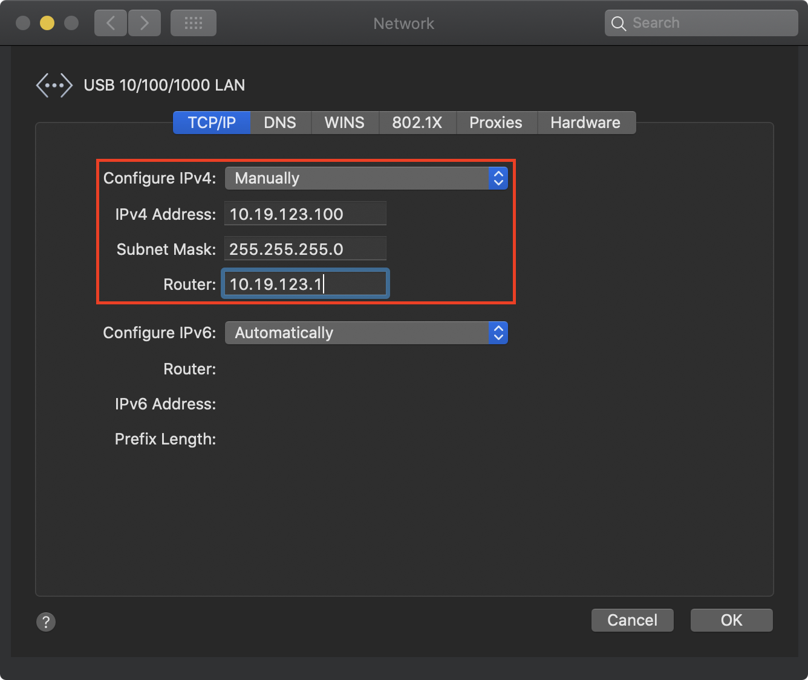

    1. Finally, click **Apply**. You should now be able to navigate to the AC1200's admin console in a web browser (located at [10.19.123.1](10.19.123.1)).
    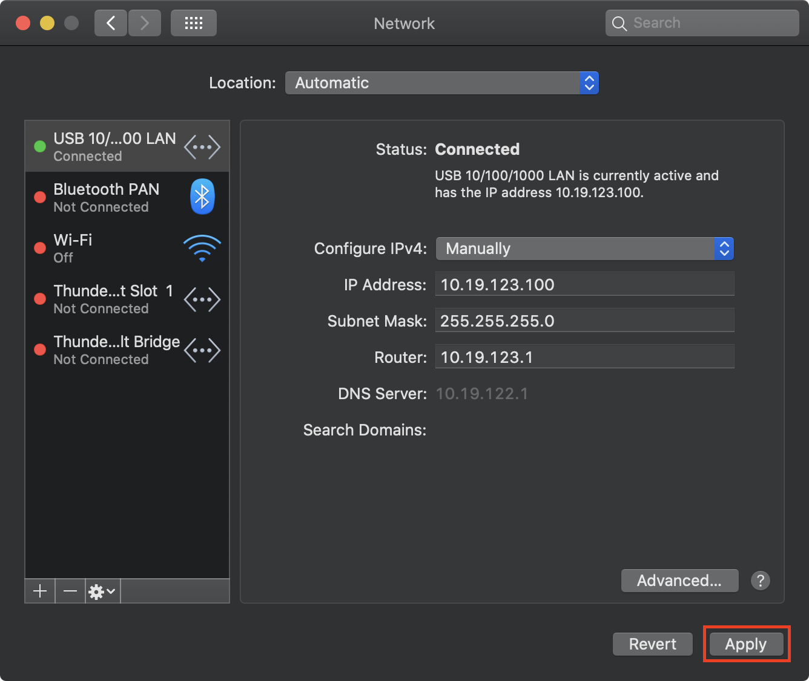

  - Windows
    1. After connecting to the AC1200, open the **Network & Internet** settings and then click on **Change connection properties** which is boxed in red in the image below:
    

    1. At the bottom of the new window, click the **Edit** button under the **IP assignment:** section, boxed in red below:
    

    1. Click the drop-down menu with the text **Automatic (DHCP)** (boxed in red below) and change it to **Manual**.
    

    1. Toggle the **IPv4** slider to **On** before filling in the fields as shown in the image below and then click **Save**. You should now be able to navigate to the AC1200's admin console in a web browser (located at [10.19.123.1](10.19.123.1)).
    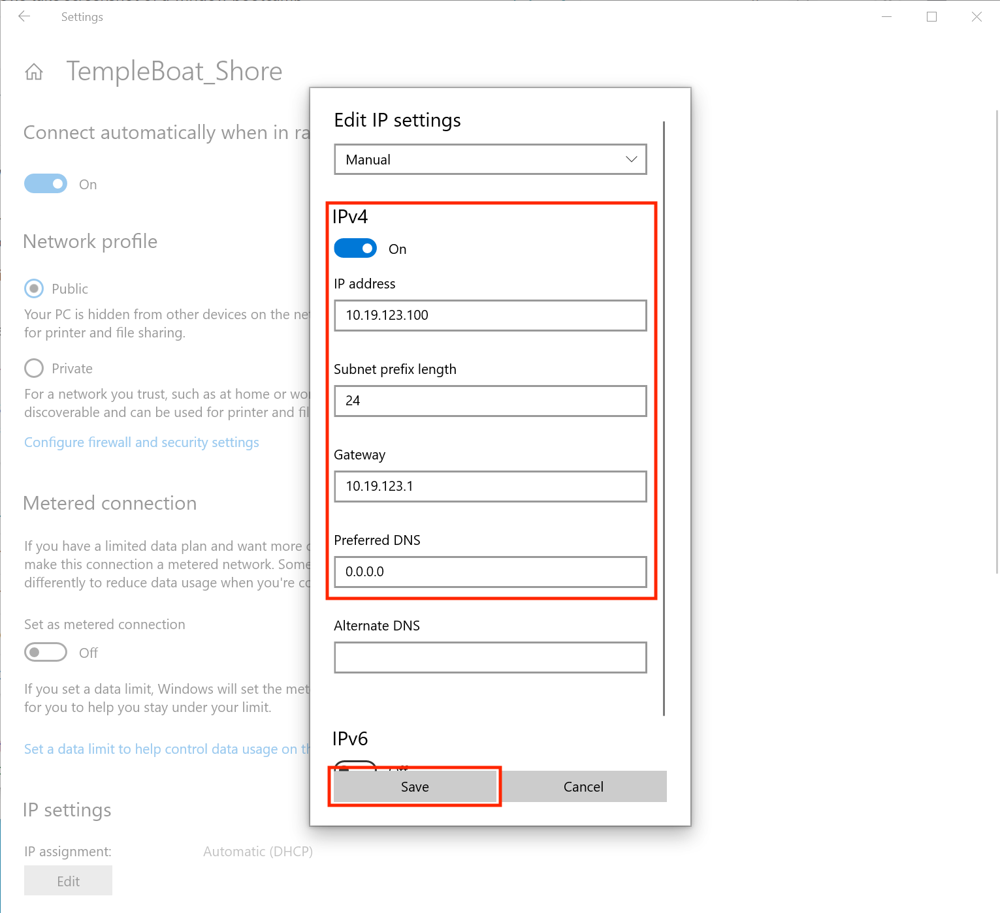

1. Navigate to the AC1200's admin console located at [10.19.123.1](10.19.123.1) and log in:
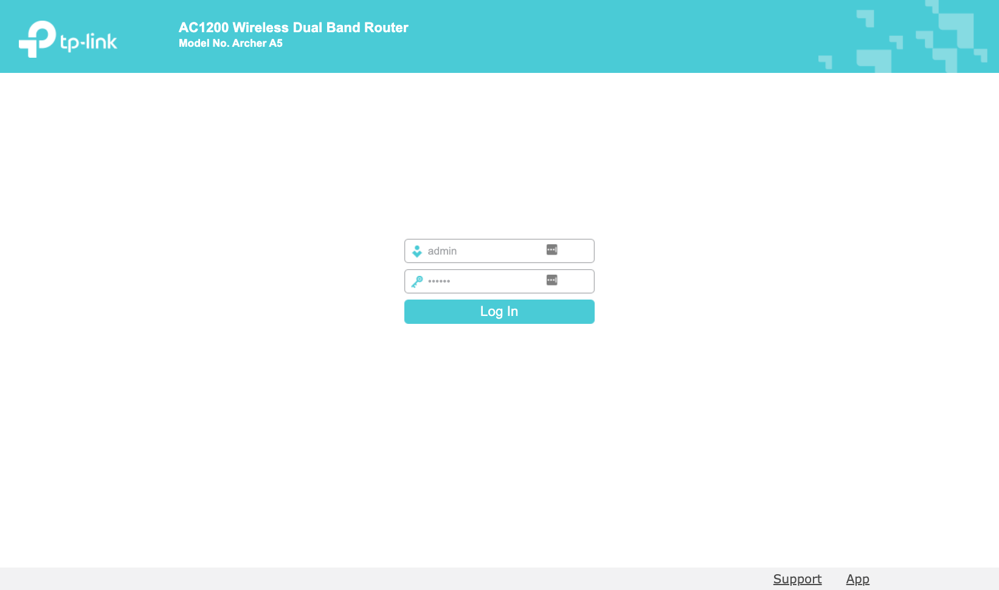

1. If bridging on the 2.4GHz band, click on the **Wireless 2.4GHz** menu (labeled as 1 in the image below) on the left side of the page. Next, select the **Channel** being used to create the WDS from the drop-down menu (labeled as 2 in the image below). Finally, click the **Scan** button to search for the AC1750's wireless network (labeled as 3 in the image below).
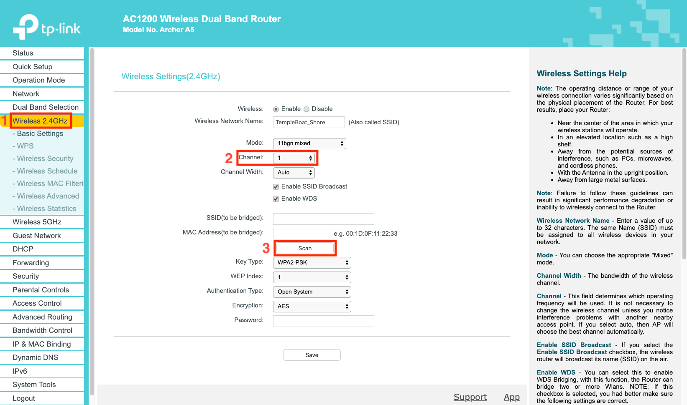

1. A new window will appear with the scan results and is shown in the image below. The AC1750's wireless network (**TempleBoat_Onboard**) can be seen on this list and is highlighted in red in the image below. Click the **Connect** link in the same row as AC1750's network (boxed in red in the image below) to select that network to form the WDS.
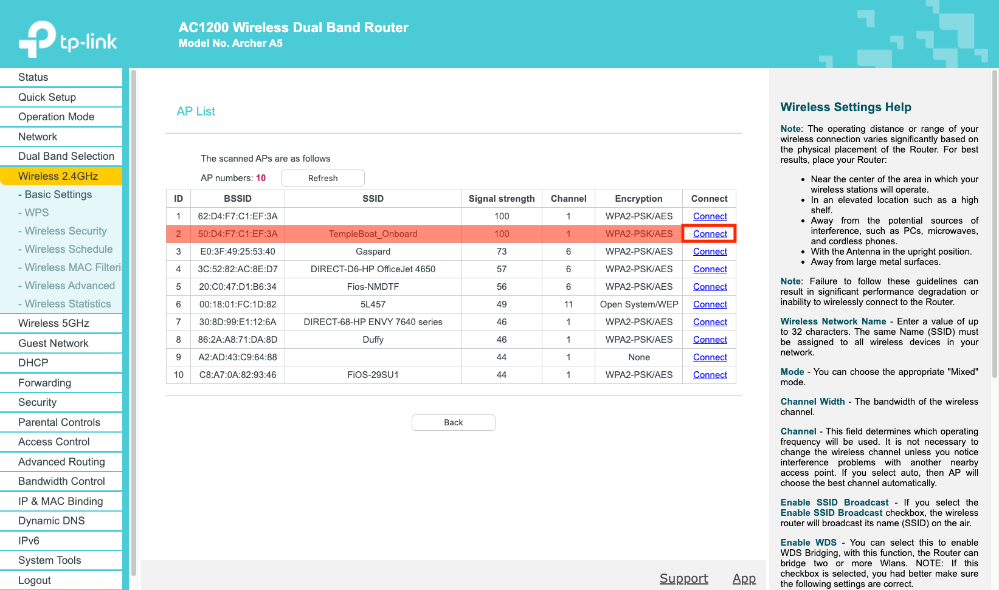

1. You will be returned to the **Wireless 2.4GHz** page after clicking **Connect** and the **SSID (to be bridged)** and **MAC Address (to be bridged)** fields will now be populated. Finally, enter the password for the AC1750's wireless network and click save.

1. Ensure that the DHCP server for the AC1200 is disabled by clicking the **DHCP** menu on the left of the admin console (labeled as 1 in the image below), selecting the **Disable** radio button next to the **DHCP Server:** label (labeled as 2 in the image below), and finally clicking **Save** (labeled as 3 in the image below).
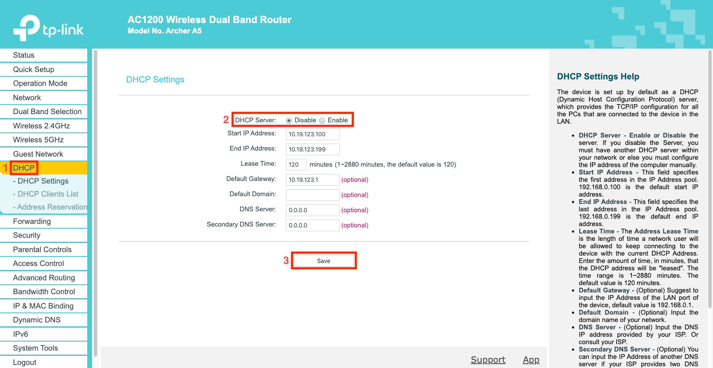
 *Note: We want to disable the DHCP server on the AC1200 as we will only be using the AC1750's DHCP server.*

1. To validate that the WDS was correctly configured, click on the **Status** menu option on the left of the AC1200's admin console (labeled as 1 in the image below). Under the **Wireless 2.4GHz** section, the **WDS Status** should be **Connected** once the WDS is bridged (labeled as 2 in the image below). *Note: It may take several minutes for the WDS to bridge, so wait some time before troubleshooting if the bridge is not immediately established.*
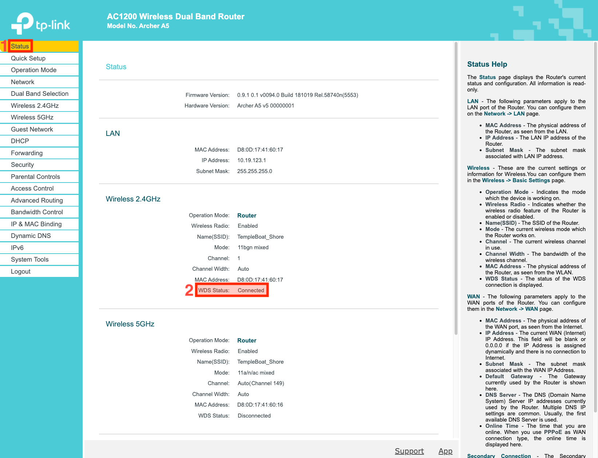
  - If the WDS does not bridge, first double check that the password was entered correctly in the previous step.

---
## Step 4) Finalizing the setup ##

Lastly, the network settings on the computer used to connect to the AC1200 must be reverted back to the original state. The sim
- macOS
  1. Open the **Network** settings in **System Preferences**
  

  1. Click the **Advanced...** button in the bottom right corner of the window
  

  1. Under the **TCP/IP** tab, change the **Configure IPv4:** drop-down selection to **Using DHCP** (labeled as 1 in the image below) and then click the **Renew DHCP Lease** button (labeled as 2 in the image below) before clicking the **OK** button (labeled as 3 in the image below).
  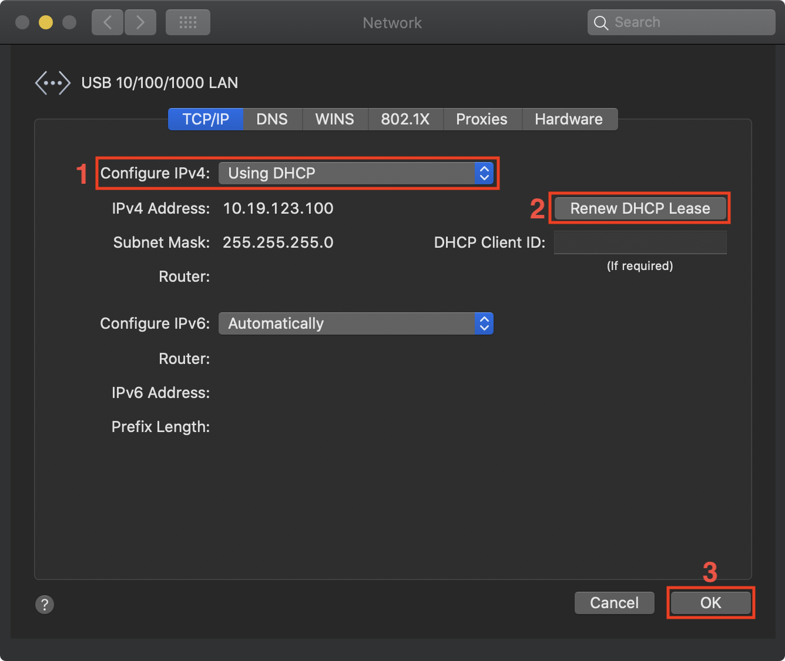

  1. After clicking **OK**, the main **Network** window will appear again and the IP Address shown will be one assigned by the AC1750, even though we are connected to the AC1200. We can tell that we are connected to the AC1750 through the AC1200 as the **Router** IP address listed in the **Network** window is the one for the AC1750 (**10.19.122.1**). Additionally, the IP address we were assigned is in the range of **10.19.122.2-255** indicating that AC1750's DHCP server assigned us an IP address. The image below contains an example IP address assigned by the AC1750, showing that the WDS was successfully bridged.
  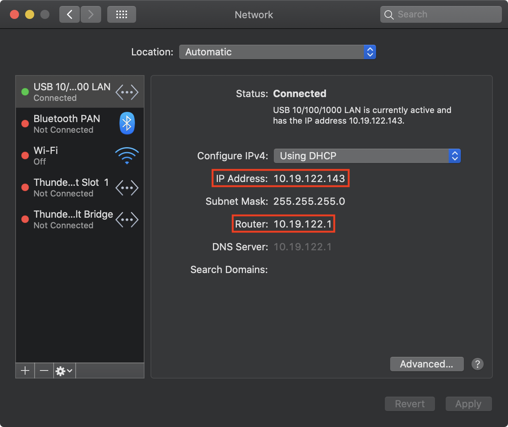

- Windows
  1. After connecting to the AC1200, open the **Network & Internet** settings and then click on **Change connection properties** which is boxed in red in the image below:
  

  1. At the bottom of the new window, click the **Edit** button under the **IP assignment:** section, boxed in red below:
  

  1. Click the drop-down menu with the text **Manual** (labeled as 1 in the image below) and change it to **Automatic (DHCP)** and then select **Save** (labeled as 2 in the image below).
  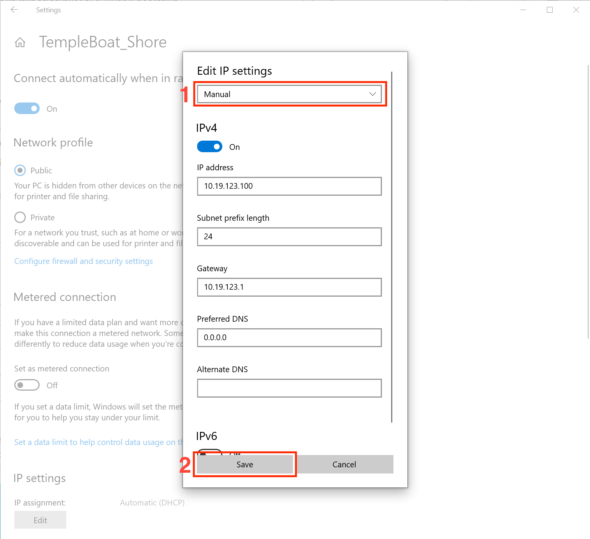

  1. After clicking **Save**, scroll to the bottom of the page and under the **Properties** section you should see an IPv4 address that was assigned by the AC1750 as it is in the range **10.19.122.2-255**.
  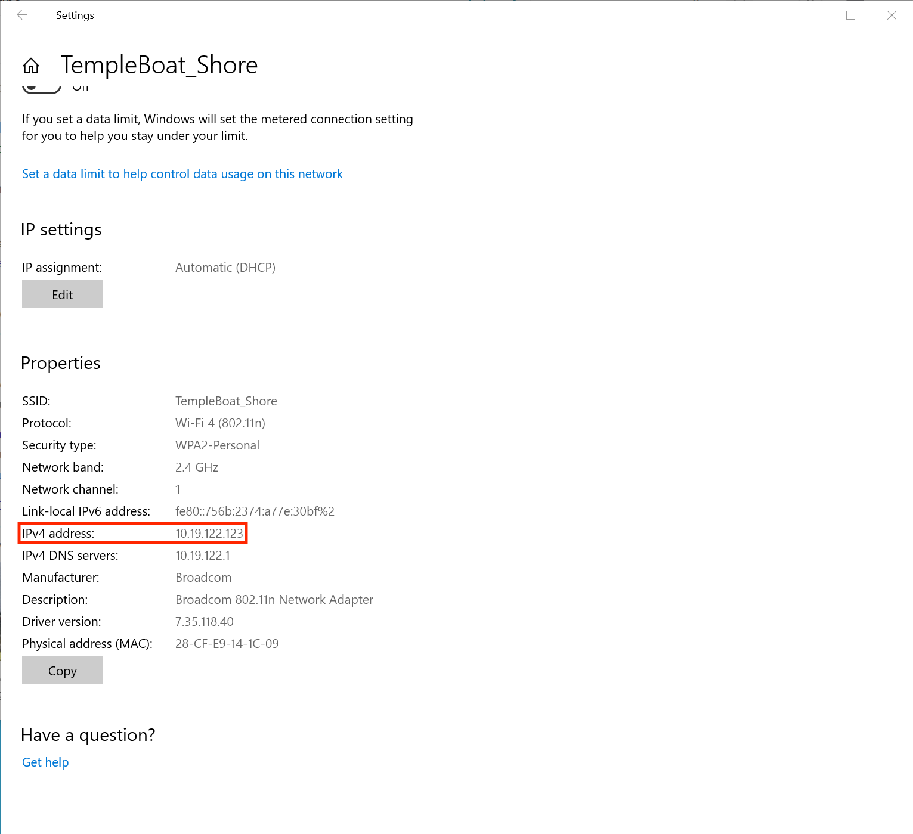

---
## Conclusion ##
This procedure should only need to be completed when moving the boat to a new location or when new wireless networks are introduced to the environment.

The bridged network is also not required to connect to the boat. Instead, when developing in the lab you can connect directly to the AC1750's wireless network (**TempleBoat_Onboard**) and this will likely yield better speeds when in close proximity. However, when testing in water, the bridged network will provide a better connection range. 
