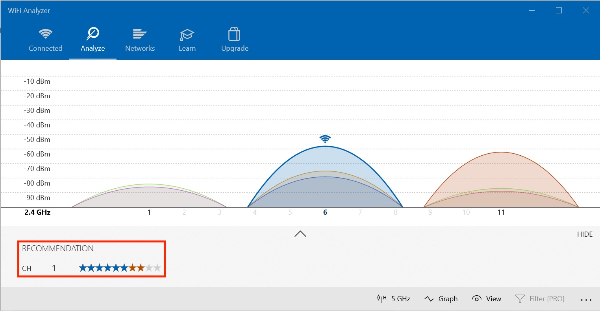

# Changing the channel and/or frequency of the bridged network#
---
## Background ##

The TP-Link AC1750 and AC1200 are bridged to form a WDS (Wireless Distribution System). In this configuration, the AC1750 installed on the boat handles the routing and runs the DHCP server while the AC1200 provides an alternative wired/wireless access point for connecting to the boat from the shore.

A bridged network is necessary as the RoboBoat competition rules require that all teams provide an RJ45 ethernet port on their shore-side control station to allow the competition staff to connect to an interface with the boat's computers.

When configuring a WDS, a wireless frequency band (2.4GHz or 5GHz) and a channel must be selected. Ideally, a frequency and channel with no or minimal usage should be selected to improve the connection quality by reducing interference. Different locations will likely have different wireless networks operating on different frequencies/channels. Therefore, it may be necessary to change the frequency and channel used to form the WDS to ensure the integrity of the communication link.

The WDS can be configured on either the 2.4GHz or 5GHz bands, but we recommend that the 2.4GHz band be used whenever possible as it provides a better transmission range.

---
## Step 1) Finding the optimal frequency/channel pair ##

 - To find the optimal frequency and channel pair all routers with the exception of the GL.iNet GL-AR750 should be turned off.
 - Next, a network utility such should be used to find the best frequency channel combination to create the WDS.
  - macOS: Using the **Wireless Diagnostics** stock macOS application.
    - Open the **Wireless Diagnostics** app that is preinstalled
    - From the menu options, select **Window**->**Scan**
    - Click the **Scan Now** button in the bottom left corner of the window
    - The summary table will contain the best channels for both the 2.4GHz and 5GHz frequencies, both of which are boxed in red below: 
  - Windows: Using the **WiFi Analyzer** application from the Microsoft Store
    - Download the **WiFi Analyzer** application ([Download Link](https://www.microsoft.com/en-us/p/wifi-analyzer/9nblggh33n0n)).
    - Open the application and click the **Analyze** icon at the top of the window
    - The channel recommendation for the 2.4GHz band is shown at the bottom of the window and boxed in red in the example image below:
    
    - The optimal 5GHz channel can be found by clicking on the **5 GHz** icon in the bottom right corner of the window shown above.

---
## Step 2) Configuring the AC1750 ##

---
## Step 3) Configuring the AC1200 ##
The AC1200's DHCP server is disabled in the WDS configuration as the AC1200 is simply acting as a
